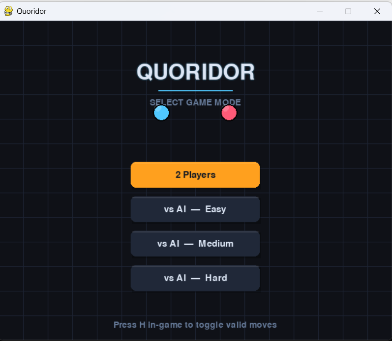
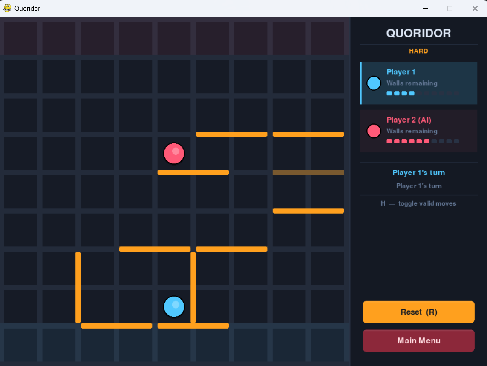
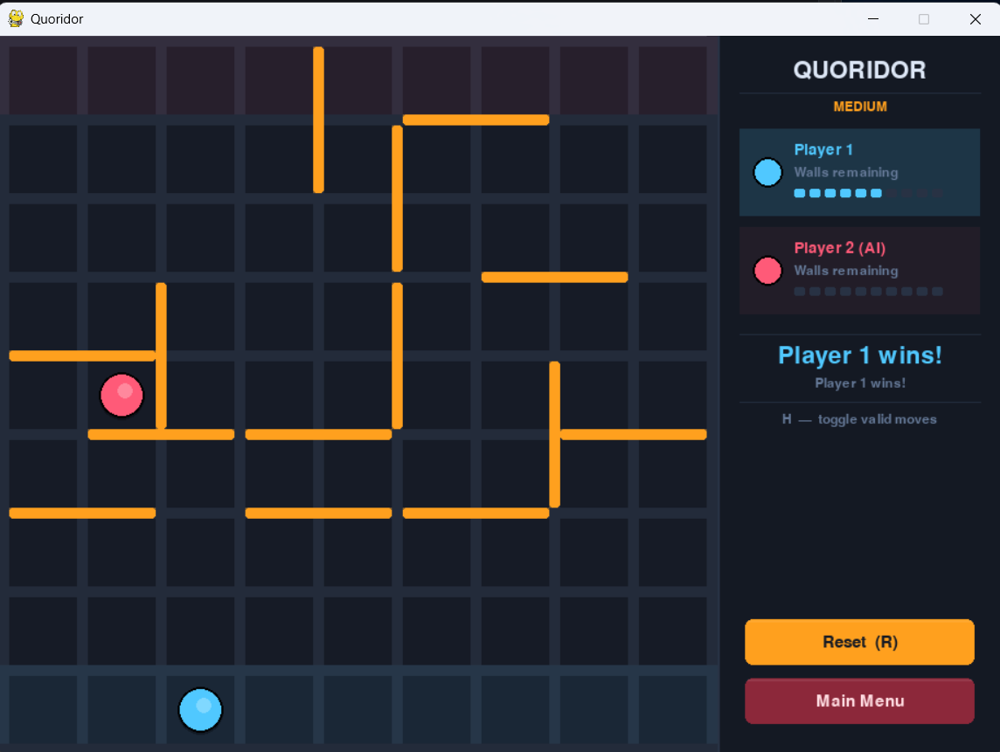
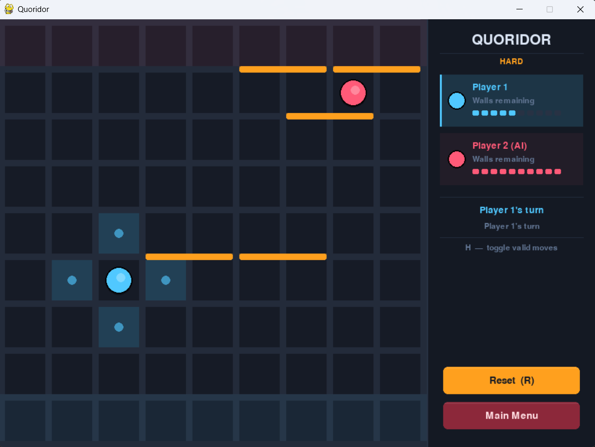

# Quoridor Game AI

A complete implementation of the **Quoridor** board game built with Python and Pygame, featuring a nigh mode UI, three AI difficulty levels, and intuitive mouse-based controls.
> CSE471s: Artificial Intelligence — Spring 2026 Project
---
## 👥 Team Members
 
| # | Name                   | Student ID |
|---|------------------------|------------|
| 1 | Mohamed Ibrahim El-Noby Mohamed |2300625|
| 2 | Zeyad Mohamed Abdelhamid Rabah |2300707|
| 3 | Omar Mohamed Ibrahim Mohamed Hegab |2300110|

---
## Game Description

Quoridor is a two-player abstract strategy board game played on a 9×9 grid. Each player starts at the center of their side of the board and must race to reach the opposite side. On each turn, a player can either **move their pawn** one square orthogonally, or **place a wall** to slow down the opponent. Walls are two squares long and cannot completely block a player's path to the goal.

**Special movement rules:**
- If your pawn is adjacent to the opponent's pawn, you can **jump over** them (if no wall blocks the jump)
- If a wall blocks the straight jump, you can **move diagonally** around the opponent

The first player to reach any square on the opposite side wins.

---

## Screenshots


### Main Menu


### Human vs AI Gameplay




### Valid Move Highlights


---

## Installation & Running Instructions

### Prerequisites
- Python **3.10 – 3.13** (Python 3.14 is not yet supported by Pygame)

### Step 1 — Install dependencies

```bash
pip install pygame numpy
```

Or if you have multiple Python versions on Windows:

```bash
py -3.13 -m pip install pygame numpy
```

### Step 2 — Clone or download the project

```bash
git clone https://github.com/zeyadmohamed61/QuoridorGame_AI.git
```

Or download and extract the ZIP and open a terminal inside the folder.

### Step 3 — Run the game

```bash
cd src
python main.py
```

On Windows with multiple Python versions:

```bash
cd src
py -3.13 main.py
```

> ⚠️ Make sure you run from inside the `src/` folder — the imports won't work otherwise.

---

## Controls

### Using Mouse
| Action | How |
|--------|-----|
| Move pawn | Click any valid (Vhighlighted) cell |
| Place wall | Click on the gap between cells (amber preview shows on hover) |

### Using Keyboard
| Key | Action |
|-----|--------|
| `H` | Toggle valid move highlights on/off |
| `R` | Reset the game |

### Sidebar Buttons
| Button | Action |
|--------|--------|
| **Reset** | Restart the current game |
| **Main Menu** | Return to the mode selection screen |

---

## Game Modes

Select your mode from the main menu:

| Mode | Description |
|------|-------------|
| **2 Players** | Local multiplayer — two humans on the same computer |
| **Human vs AI — Easy** | AI plays randomly with occasional wall placement |
| **Human vs AI — Medium** | AI uses shortest-path strategy and tactical wall blocking |
| **Human vs AI — Hard** | AI uses Minimax with Alpha-Beta pruning and look-ahead |

---

## AI Difficulty Levels

### Easy
Randomly selects from all legal pawn moves. Has a 30% chance each turn to attempt a random wall placement (validated with BFS to ensure no player is fully blocked).

### Medium
Uses BFS to calculate the shortest path to the goal for both players. Each turn it compares: *"is it better to move forward, or place a wall that lengthens the opponent's path?"* — and picks whichever gains more advantage.

### Hard
Uses **Minimax with Alpha-Beta pruning** to look several moves ahead, assuming both players play optimally. Evaluates board positions using a heuristic based on the difference in path lengths to goal, adjusted by remaining wall counts. Short-circuits immediately if a winning move is found.

---

## Project Structure

```
QuoridorGame_AI/
└── src/
    ├── main.py              # Entry point
    ├── game/
    │   ├── board.py         # Board state and wall storage
    │   ├── gameState.py     # Game rules, move validation, win detection
    │   ├── pathFinding.py   # BFS path checking
    │   └── player.py        # Player data (position, walls remaining)
    ├── ai/
    │   ├── aiPlayer.py      # Abstract base class + AIMove type
    │   ├── easy_ai.py       # Random AI
    │   ├── medium_ai.py     # Path-based strategic AI
    │   └── hard_ai.py       # Minimax + Alpha-Beta AI
    ├── gui/
    │   ├── menuScreen.py    # Main menu with mode selection
    │   ├── gameScreen.py    # Game loop, input handling, sidebar
    │   ├── boardRenderer.py # Board drawing, wall previews, highlights
    │   └── constants.py     # UI colors, fonts, dimensions
    └── util/
        └── constants.py     # Game constants (board size, wall count, etc.)
```

---

## Demo Video

▶️ [Watch the demo video here](https://YOUR_DEMO_VIDEO_LINK)

---


